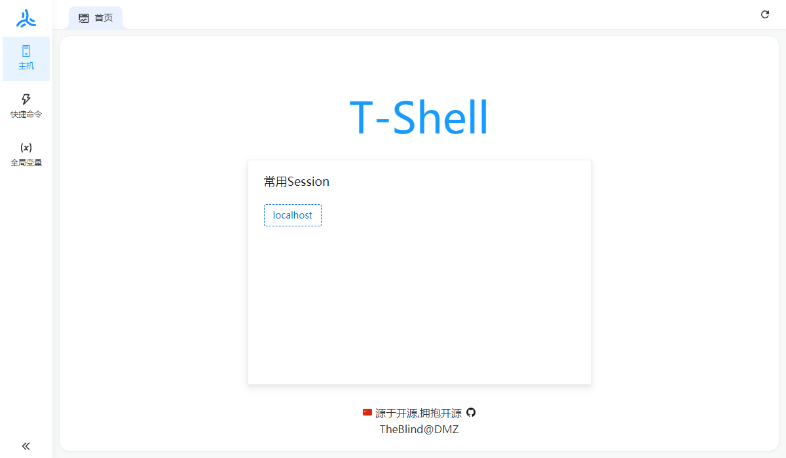
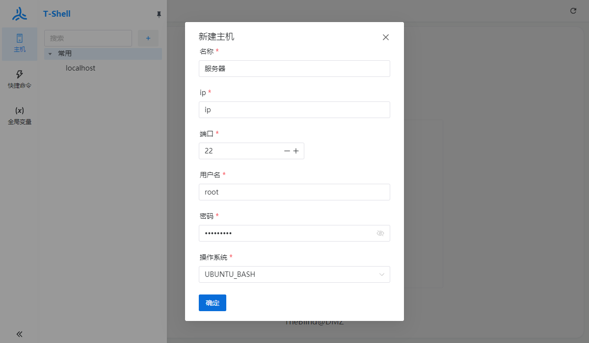
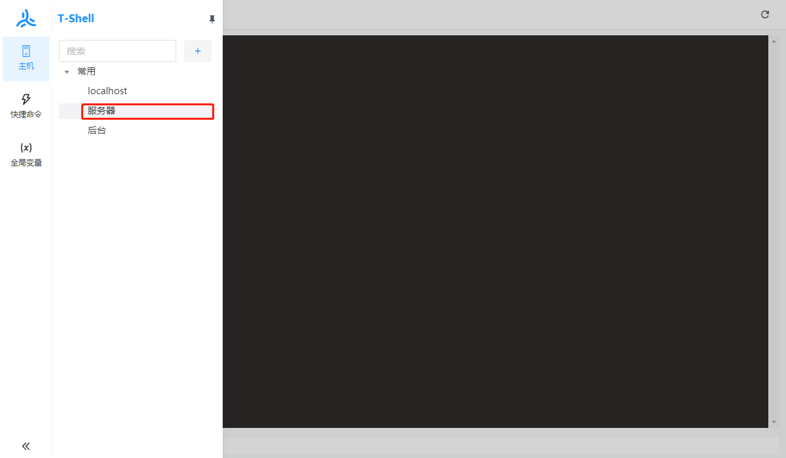
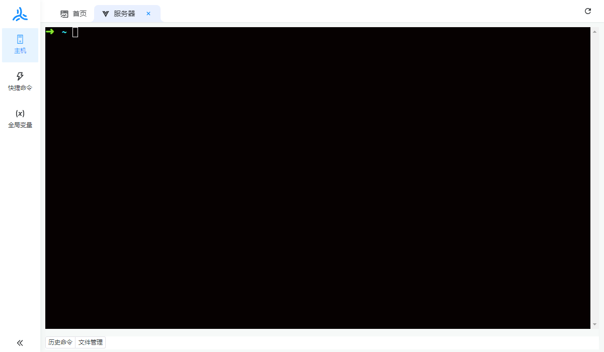
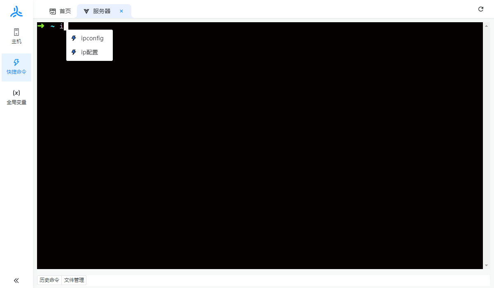
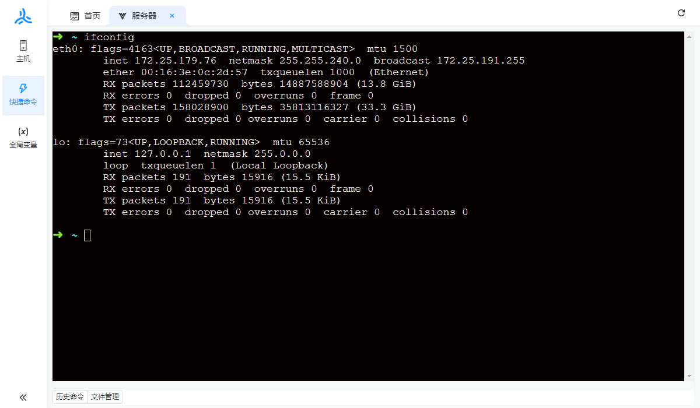
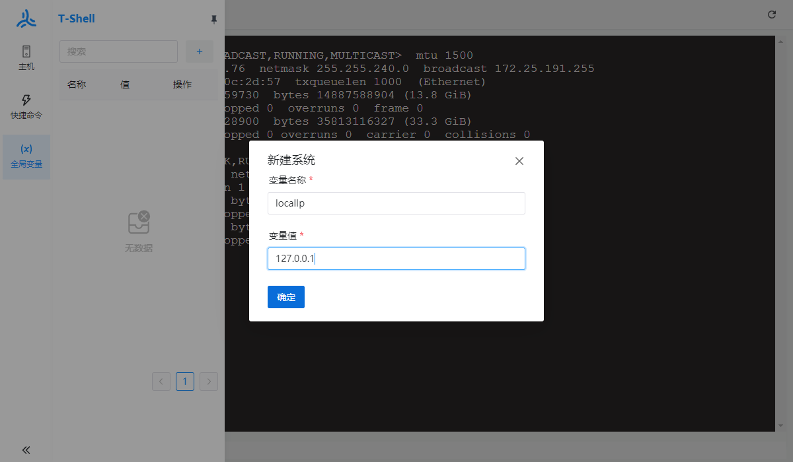
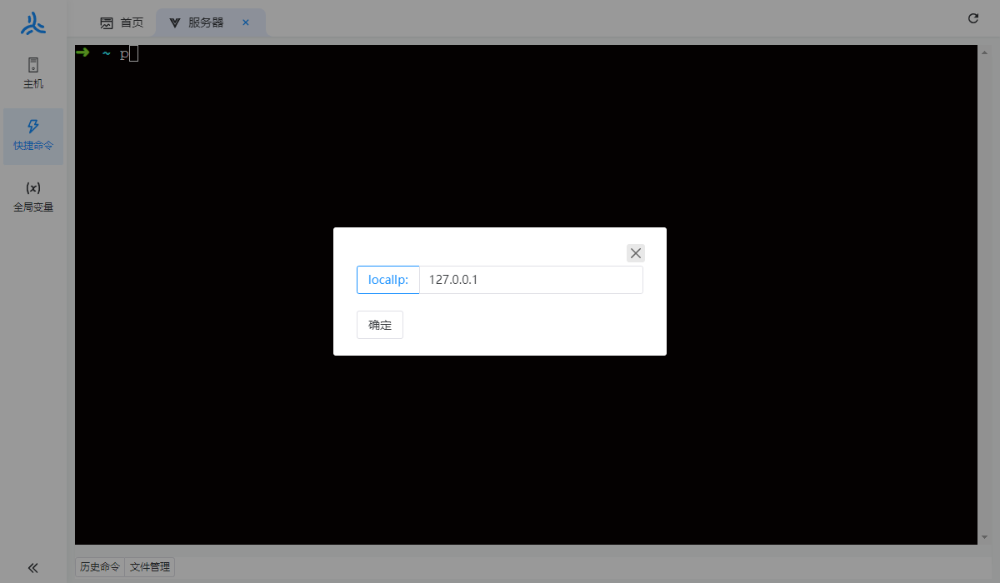
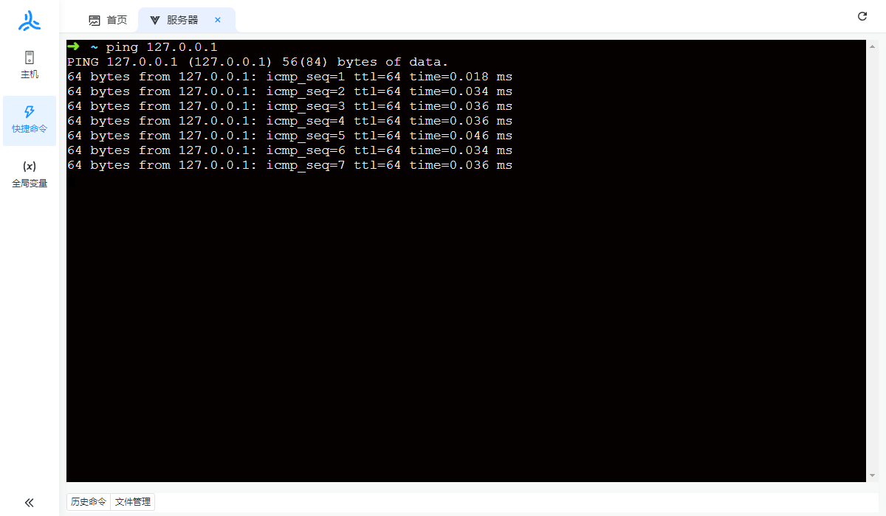

	<h1>T-Shell</h1>

----

[**T-Shell**](https://github.com/TheBlindM/T-Shell) (**TheBlindShell**) 是一个可配置命令提示的终端模拟器和 SSH客户端，目前只支持 Windows

* 集成 SSH
* 本机操作(设计中)
* 定制主题和配色方案(设计中)
* 快捷命令提示 一次编写,处处运行
* 支持 linux中的终端如:bash,zsh
* 支持 中文
* 支持 SFTP

# T-Shell是什么

	

* **T-Shell 是**一个让你摆脱繁琐的命令,不用每次去百度,去记事本里找

* **T-Shell 不是**一个全新的 shell，目的是为了取代FinalShell。它也不是轻量级的,但是比FinalShell内存占用小 - 如果你对内存的占用很敏感,请选择其它产品

* **T-Shell 是**一个刚刚起步的项目,虽然不知道以后会发展成什么样子。 但是如果这个**应用**，或者**代码**，能帮到你。能让你学到到点东西,那这个项目就没白写！(格局一下子打开)

**开源地址:** [GitHub](https://github.com/TheBlindM/T-Shell) [Gitee](https://gitee.com/The-Blind/t-shell)

声明：开源，无后门，个人开发难免会存在一些BUG
# 使用说明
## 主机
**新建主机**

	

**开启会话**

双击节点

	

	

## 快捷命令
快捷命令 是对不同终端中相同作用,但是命令不同的一种抽象

**新建快捷命令**

	

**新增实现**

	

**效果**

	

	

## 全局变量
全局变量 目前只能用于 快捷命令中 通过${全局变量名称}来使用

**新增**

	

**使用**

	

**效果**

	

	

 
## 微信

	

